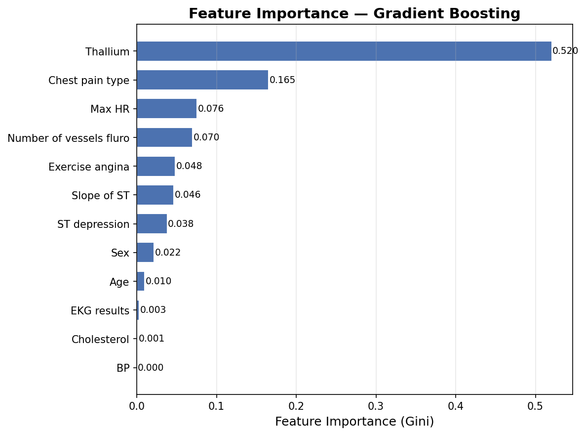
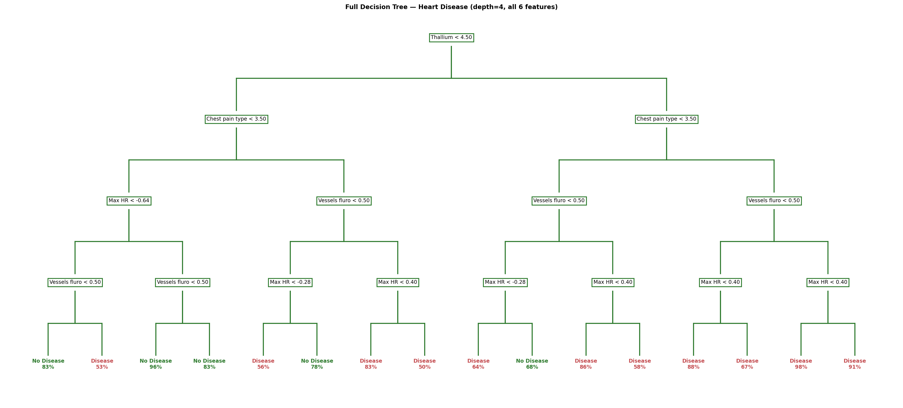
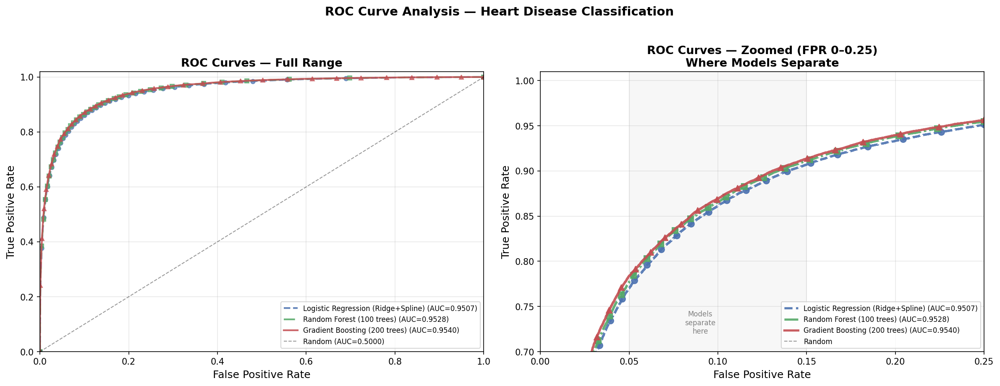
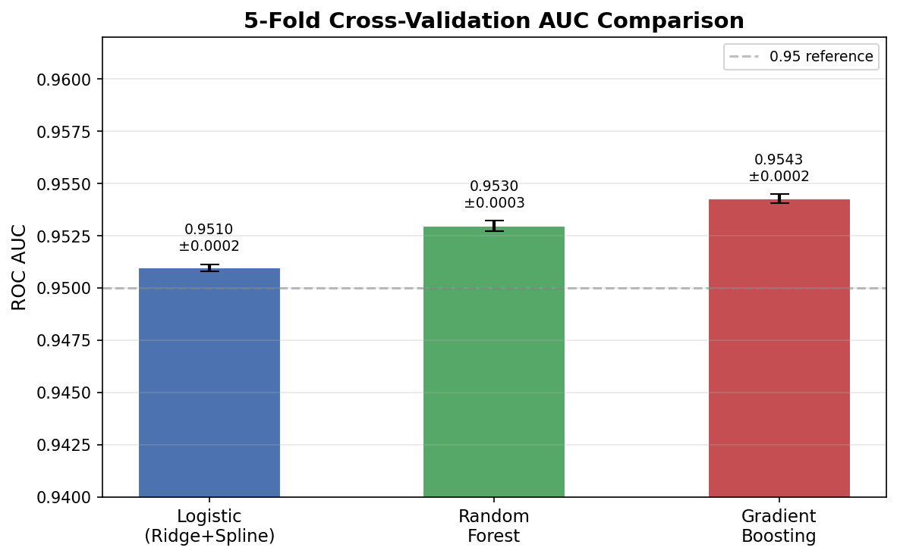
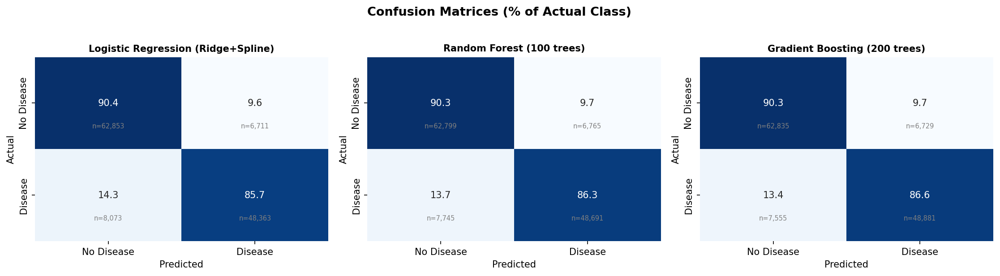

# Midterm Project Report — Heart Disease Prediction

---
## 1. Problem Description

This project builds a machine learning model to estimate the probability of heart disease from 13 clinical features. Probability estimates from this model may support clinicians in identifying high-risk patients and prioritizing targeted preventive treatment.

  The training dataset contains 630,000 observations and the test dataset contains 270,000 observations. The training data was synthetical and generated by a deep learning model that had been trained on a real heart disease prediction dataset. Using synthetic data preserves patient privacy while enabling training. Each observation included 13 features and one binary response variable, ***Heart Disease***, encoded as 0 (absence) and 1 (presence). There are no missing values in either dataset. The 13 predictor features span continuous, binary, and ordinal types (see Table A1 in the Appendix for a complete feature dictionary).
  
  The goal of this project is to accurately estimate the probability of heart disease for unseen test observations. Success is evaluated using the **Area Under the Curve (AUC)**. An AUC of 1.0 represents perfect discrimination between classes; an AUC of 0.5 represents performance equivalent to random guessing.
  Predicting heart disease from routine clinical data has direct implications for patient care. A reliable probability estimate allows clinicians to risk-stratify patients and prioritize preventive intervention for those most at risk. Using synthetic training data further supports this by enabling model development without exposing sensitive patient records. 

## 2. Methodology
  Three models were tested, all evaluated with 5-fold stratified
cross-validation scored by AUC.
  **Logistic Regression with Ridge regularization** served as the
interpretable baseline. Ridge shrinks large coefficients and reduces
overfitting on correlated features. Cubic splines (degree = 3,
n\_knots = 5) were added to continuous features to capture non-linear
patterns while keeping coefficients interpretable.
  
  **Random Forest** builds many decorrelated trees via bootstrap sampling,
which reduces variance relative to a single tree. It handles mixed
feature types without scaling. Feature importance was estimated using
mean decrease in impurity (MDI), which is known to favor
high-cardinality features and should be read with that caveat.
Hyperparameters explored: `n_estimators` up to 100 (memory-constrained),
`max_depth` in {5, 10, None}, `min_samples_split` in {2, 5}.
  
  **Gradient Boosting** fits each new tree to the residual errors of the
current ensemble, concentrating capacity on misclassified observations.
This allows it to learn feature interactions that the other two models
cannot. Hyperparameters tuned: `n_estimators` in {100, 200, 300},
`learning_rate` in {0.05, 0.1, 0.2}, `max_depth` in {3, 4, 5}.
  
  To screen feature-outcome associations, bivariate correlations were computed for all predictors as a descriptive tool, not a formal test. Point-biserial correlation was used for continuous features. Pearson correlation was used for binary predictors. Pearson was also used for ordinal predictors as an approximation; Spearman would be more appropriate where intervals are unequal (e.g., Thallium: 3, 6, 7). Thallium Stress Test and Chest Pain Type showed the strongest positive correlations with the outcome (see Table A2 in the Appendix for full correlation rankings).
  
  Gradient Boosting was selected as the final model based on the highest
cross-validation AUC (0.9540) and highest sensitivity (86.6%). The
decision threshold was evaluated across the full ROC curve post-training;
results confirm a lower threshold can improve sensitivity further at an
acceptable specificity cost. The values in the Results table use the
default threshold of 0.5. Random Forest was limited by compute
constraints with `n_estimators` capped at 100. Logistic Regression was
a strong baseline but boosting captured non-linear structure that
improved sensitivity. The main weakness of Gradient Boosting is reduced
interpretability, which is partially addressed via feature importance
analysis in the Results section.
  
  Data was preprocessed as follows: the target was encoded (`Presence` = 1, `Absence` = 0); continuous features were z-score standardized with the scaler fit on training data only to prevent leakage; no imputation was needed; outliers (z > 3.0) were retained as potentially valid extreme values. LassoCV (5-fold, L1 penalty) was applied as a standalone feature selection step before any model fitting. Blood Pressure (|r| = 0.005) had its coefficient shrunk to zero and was dropped, leaving 12 features. This reduced set was used for all models. Applying LassoCV-derived selection to other models is a known limitation as it can introduce selection bias. Splines were applied to continuous features for Logistic Regression only. Logistic Regression C was tuned via GridSearchCV over [0.001, 0.01, 0.1, 1, 10, 100]. Final hyperparameters: Gradient Boosting `n_estimators = 300`, `learning_rate = 0.1`, `max_depth = 4`; Random Forest `n_estimators = 100`, `max_depth = None`, `min_samples_split = 2`. Full reproducibility details, including the GitHub repository link and core preprocessing scripts, are provided in Appendix C.

## 3. Results and Evaluation
  AUC was used as the primary metric because it measures how well a
model ranks positive cases above negative cases across all thresholds,
rather than performance at a single cutoff. Sensitivity and specificity
are reported at the default 0.5 threshold on held-out CV predictions.

| Model | CV AUC (95% CI) | Sensitivity | Specificity |
|---|---|---|---|
| Gradient Boosting | **0.9540** [0.951–0.957] | **86.6%** | 90.4% |
| Random Forest | 0.9528 [0.949–0.955] | 86.3% | 90.4% |
| Logistic Regression | 0.9507 [0.948–0.953] | 85.7% | 90.4% |

  Differences in AUC are small (delta AUC <= 0.003); no formal
significance test was conducted. All three models reached the same
specificity at the 0.5 threshold, suggesting further gains there would
require threshold tuning rather than a model change.

  Gradient Boosting feature importances (Figure 1, Appendix) ranked
Thallium stress test first, followed by Chest Pain Type. MDI is
influenced by how often a feature is used in splits and should not be
read as a causal measure. It is directionally consistent with the
bivariate correlations above, where Thallium also ranked first, though
the two measures are not independent.
 
  Blood pressure had near-zero correlation with the outcome (|r| = 0.005)
and was dropped by LassoCV. BP is a standard feature in clinical risk
scores like the Framingham Risk Score, but here it added no information
beyond what the direct cardiac measurements already captured. This
illustrates a general point: a feature's usefulness depends on what
else is in the model, not just its clinical prominence.

  The primary strength of this approach is that all models achieved a high AUC of at least 0.950 using a fully reproducible end-to-end pipeline. Additionally, applying LassoCV provided an objective method for feature selection without requiring manual tuning. However, there are notable limitations to this methodology. The final Gradient Boosting model operates largely as a black box, which restricts its clinical interpretability. Furthermore, the model comparisons are not entirely balanced due to compute constraints that capped the Random Forest estimators. Finally, the reliance on synthetic training data means the learned patterns may not perfectly reflect real-world clinical distributions

  All three models fell within a narrow AUC range (0.9507 to 0.9540), showing the outcome signal is recoverable by multiple methods (Figure 3, Appendix). Gradient Boosting had the highest sensitivity (86.6% vs. 85.7% for Logistic Regression) and was selected as the final submission on that basis. The uniform specificity across models suggests differences arise in how each model handles hard positive cases, not easy negatives.

## Appendix

### A. Supplementary Data Tables

**Table A1: Clinical Feature Descriptions**
| Feature | Type | Description |
|---|---|---|
| Age | Continuous | Patient age in years |
| Blood Pressure | Continuous | Resting blood pressure (mmHg) |
| Cholesterol | Continuous | Serum cholesterol (mg/dl) |
| Max Heart Rate | Continuous | Maximum heart rate achieved during stress test |
| ST Depression | Continuous | Magnitude of ST-segment depression on ECG induced by exercise, a marker of myocardial ischemia |
| Sex | Binary | 0 = Female, 1 = Male |
| Fasting Blood Sugar | Binary | Fasting blood glucose > 120 mg/dl — 0 = No, 1 = Yes |
| Exercise-Induced Angina | Binary | Chest pain triggered by exercise — 0 = No, 1 = Yes |
| Chest Pain Type | Ordinal | 1 = Typical Angina, 2 = Atypical Angina, 3 = Non-Anginal, 4 = Asymptomatic |
| EKG Results | Ordinal | 0 = Normal, 1 = ST-T Wave Abnormality, 2 = Left Ventricular Hypertrophy |
| Slope of ST | Ordinal | 1 = Upsloping, 2 = Flat, 3 = Downsloping |
| Number of Vessels (Fluoroscopy) | Ordinal | Number of major coronary vessels visible under contrast dye (0–3) |
| Thallium Stress Test | Ordinal | 3 = Normal, 6 = Fixed Defect, 7 = Reversible Defect |

<br>

**Table A2: Bivariate Feature-Outcome Correlations**
| Rank | Feature | \|r\| | Direction |
|---|---|---|---|
| 1 | Thallium Stress Test | 0.606 | Positive |
| 2 | Chest Pain Type | 0.461 | Positive |
| 3 | Exercise-Induced Angina | 0.442 | Positive |
| 4 | Max Heart Rate | 0.441 | Negative |
| 5 | Number of Vessels | 0.439 | Positive |
| 6 | ST Depression | 0.431 | Positive |
| 7 | Slope of ST | 0.415 | Positive |
| 8 | Sex | 0.342 | Positive |
| 9 | EKG Results | 0.219 | Positive |
| 10 | Age | 0.212 | Positive |
| 11 | Cholesterol | 0.083 | Positive |
| 12 | Fasting Blood Sugar | 0.034 | Positive |
| 13 | Blood Pressure | 0.005 | Positive |

---

### B. Model Interpretability and Performance Visualizations


**Figure 1:** Gradient Boosting feature importances (mean decrease in impurity), normalized to sum to 1.0. Thallium Stress Test and Chest Pain Type had the highest impurity-based importances in the model. These values reflect relative split frequency and should not be interpreted as proportional causal contributions.


**Figure 2:** Decision tree (depth=4, 6 features) illustrating the primary decision logic learned by tree-based models. This provides an interpretable reference for the tree structure before ensembling.


**Figure 3:** ROC curves for Gradient Boosting (AUC = 0.9540), Random Forest (AUC = 0.9528), and Logistic Regression (AUC = 0.9507). The right panel zooms into the 0–0.25 False Positive Rate range where model separation is most visible.


**Figure 4:** 5-Fold Cross-Validation AUC Comparison. Error bars indicate variance across the five folds, demonstrating high stability across all models.


**Figure 5:** Confusion matrices shown as a percentage of the actual class. Values reflect performance at the default 0.5 classification threshold.

---

### C. Reproducibility

**Code:** github.com/AidanColvin/machine-learning-midterm-project
**Language:** Python 3.11 | **Libraries:** scikit-learn 1.4.0,
pandas 2.1.4, numpy 1.26.2, scipy 1.11.4 | `random_state = 42`
throughout.
```bash
pip install -r requirements.txt
python3 src/generate_submissions.py
```
```python
# Key preprocessing step
lasso = LogisticRegressionCV(cv=5, penalty='l1', solver='saga')
lasso.fit(X_train, y_train)
selected = X_train.columns[lasso.coef_[0] != 0]  # drops Blood Pressure
X_train, X_test = X_train[selected], X_test[selected]
```
